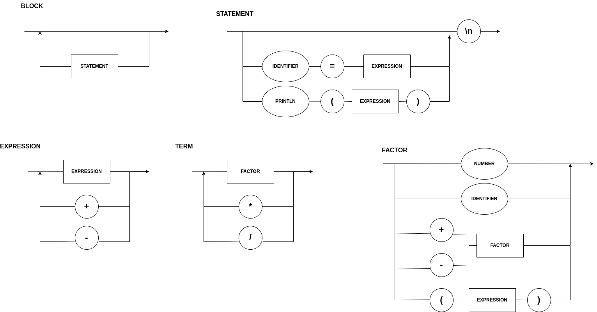

# Compiler
Compilador desenvolvido na disciplina de Lógica da Computação , 7° Semestre Engenharia da Computação , INSPER.

### Installing scala ⚙️

```bash
sudo apt update
sudo apt -y install scala
```

Testing installation : 
```bash
scala -version
```

### Run Main.scala 📌️
```bash

# Compile
scalac *.scala 

# Run code passing arguments
scala Main '1+2'
```
To know more : [Scala Official Documentation](https://docs.scala-lang.org/overviews/scala-book/hello-world-1.html)

### Diagram ⚠️



### EBNF

```bash

EXPRESSION = TERM, { ("+" | "-"), TERM } ;
TERM = FACTOR, { ("*" | "/"), FACTOR } ;
FACTOR = ("+" | "-") FACTOR | "(" EXPRESSION ")" | number ; 

NUMBER = DIGIT , {DIGIT} ; 
DIGIT = 0 | 1 | ... | 9 ;

```

### Test Status 👩‍💻️

